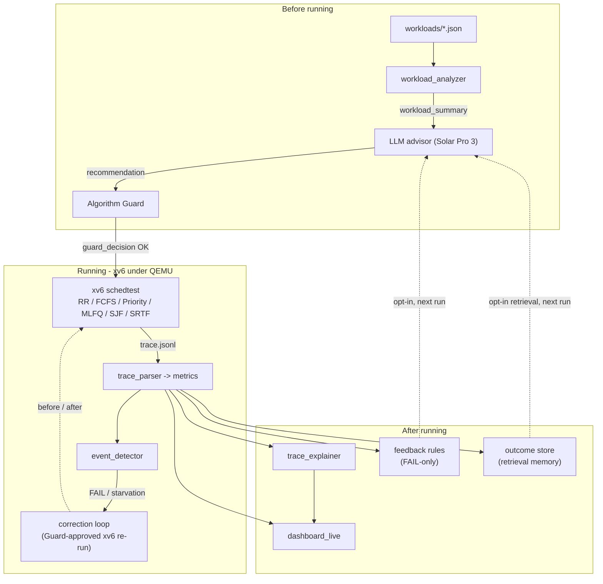
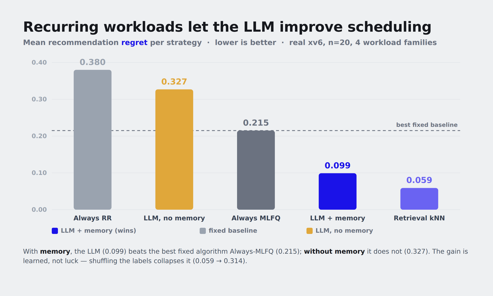

# LLM Sched Copilot

**An LLM-assisted scheduler for xv6** — course project, *Direction B (LLM for OS)*, Team **Tricycle**.
Upstage Solar Pro 3 **advises**, an Algorithm Guard **validates**, and **xv6 under QEMU executes**.

> **One-line finding (measured, not assumed):** the LLM loses the quantitative
> decision hot path (algorithm choice, mid-run switching, numeric burst
> prediction — classical methods win, shown with negative controls) but **wins at
> the human interface** (NL intent → config 8/8, trace explanation) **and learns
> recurring workload patterns** (retrieval warm-start drops recommendation
> regret 0.28 → ≈0 after one same-family precedent).

## 1. Core idea

Traditional xv6 scheduling is fixed and visible only through logs. This project
turns it into a trace-verified, LLM-in-the-loop workflow: from *visible* workload
features the LLM proposes a Scheduling Algorithm, parameters, and burst hints;
the **Algorithm Guard** validates them; and **xv6 is the sole execution
authority** — the LLM is never on the kernel hot path and never picks the next
process. We then *measured* where an LLM actually helps, and put it there:
**the OS's human-facing layer, not its decision hot path.**

## 2. Architecture

Three host-side phases wrap the kernel; the Orchestrator
(`scripts/orchestrator.py`) sequences them but is **not** the scheduler. All
module interfaces are JSON / JSONL.



## 3. OS concepts in play

| OS concept | Where it lives |
|---|---|
| CPU scheduling | `kernel/proc.c` — six algorithms + aging/boost; `kernel/trap.c` timer preemption |
| Processes & context switching | xv6 `proc` table; `user/schedtest.c` forks the workload |
| System calls | `setscheduler`/`getscheduler`, `setpriority`/`getpriority`, `setpredictor`, `setrrquantum`, `setmlfqparams`, `setbursthint` |
| Synchronization | spinlocks guarding the proc table during scheduling decisions |
| IPC | `schedtest` one-byte pipe **start barrier** (race-free metadata before a child runs) |
| Timer interrupts | `kernel/trap.c` drives quantum expiry / preemption |

## 4. Quick start

```bash
pip install -r requirements.txt          # host deps (python-dotenv)
cp .env.example .env                      # then edit: UPSTAGE_API_KEY=<your key>
cd dashboard_live && npm install          # dashboard deps
```

Prerequisites: a RISC-V toolchain (`riscv64-unknown-elf-gcc`) and
`qemu-system-riscv64`. The Solar Pro 3 key goes in `.env` only — it is
git-ignored, never commit it.

## 5. How to run

```bash
# Full pipeline on a curated xv6 profile (analyze → advise → guard → run all 6
# algorithms on xv6 → metrics → correct → explain → feedback/outcome):
python3 scripts/orchestrator.py --workload interactive

# Natural-language intent → Guard-valid config (the LLM's measured win):
python3 scripts/orchestrator.py --intent "Interactive desktop; latency matters."

# Recurring random workload (the premise made live): a jittered instance of a
# recurring pattern on real xv6, retrieval warm-start ON:
python3 scripts/orchestrator.py --random-family interactive --seed 1000

# Dashboard (with the live RUN button → scripts/run_server.py executor):
python3 scripts/run_server.py             # terminal 1 — local xv6 executor
cd dashboard_live && npm run dev          # terminal 2 — http://localhost:5174

# Raw kernel to a shell:
cd xv6-riscv && make qemu                 # Ctrl-A X to quit
```

## 6. Demo

Staged dashboard flow: **RUN ANALYSIS** (real LLM call) → typewriter reveal →
**RUN VISUALIZATION** (per-algorithm traces: Gantt / lanes / process states) →
**VIEW EVALUATION** (metrics, judgment, runtime correction, NL explanation) →
**Learning** tab (the measured adaptive-learning study). The header RUN button
triggers a *real local xv6 execution* — never a replay; toggling
**🎲 recurring random workload** makes each RUN a fresh same-family instance so
the retrieval warm-start improves run over run.




## 7. Verification at a glance

| Check | Result |
|---|---|
| `pytest` (host pipeline, guard, metrics, learning) | **173 passed** |
| `cd dashboard_live && npm test` (Vitest) | **28 passed** |
| `python3 scripts/final_demo_check.py` (compile · tests · build · contract · xv6 smoke · trace sanity) | **6 PASS / 0 FAIL** |
| `experiments/xv6_determinism_probe.py` | metrics reproduce run-to-run (`-icount` + fixed-iteration bursts + tick-aligned start) |
| Honesty gates | no future-burst leakage (strip keys + leave-one-out retrieval), negative controls pass |

## 8. Feature status

- [x] Six in-kernel Scheduling Algorithms (RR · FCFS · Priority+Aging · MLFQ · SJF · SRTF) + scheduling syscalls
- [x] Deterministic, reproducible xv6 execution under QEMU `-icount`
- [x] LLM advisor (visible features only) + **Algorithm Guard** validation with safe fallback
- [x] Host-side post-evaluation **runtime correction** (Guard-approved xv6 re-run, before/after recorded)
- [x] **Semantic lane** `--intent`: NL workload intent → valid scheduling config (8/8 rubric)
- [x] Trace Explainer (NL explanation) + FAIL-only feedback rules (consumption opt-in)
- [x] **Retrieval learning loop**: outcome store accumulates every run; `--use-retrieval` warm-starts from recurring patterns
- [x] `--random-family` live mode + dashboard toggle (recurring-workload demo on real xv6)
- [x] React observability dashboard (LLM / Visualization / Evaluation / Learning) + strict data-contract validator

## 9. Repository layout

```
xv6-riscv/              the kernel — execution authority (schedulers, syscalls, schedtest.c)
scripts/                orchestrator.py (control plane) · run_server.py (dashboard executor)
                        · final_demo_check.py · export tools
tools/                  pipeline modules: analyzer, advisor, intent_advisor, guard,
                        trace_parser, metrics, event_detector, correction_*, trace_explainer
experiments/            evidence tools: determinism probe, burst evals, intent eval,
                        learning-curve study, workload generators
workloads/              workload definitions (*.json)
dashboard_live/         React observability dashboard
docs/                   design notes + deliverables — see docs/README.md (documentation map)
outputs/                committed measured evidence (RESULTS.md per study) + run artifacts
```

## 10. Limitations & future work

Single-hart kernel (CPUS=1), curated xv6 workload tables (arbitrary workloads
inject via `schedtest --procs`), SJF/SRTF cold-start degrades to arrival order by
design (no future-burst rule), correction is post-evaluation host-side (never
in-kernel). Full list: [docs/system_limitations.md](docs/system_limitations.md).

## 11. Documentation & deliverables

Full documentation map: **[docs/README.md](docs/README.md)** — technical report
(deliverable #2), development process (deliverable #3), design references, and
the committed measured evidence behind every claim.

## 12. Team

| Member | Role (from commit history) |
|---|---|
| Jeong Seonguk | integration · xv6 kernel & schedulers · orchestrator · dashboard |
| Choi (hsChoi) | workload definitions · workload analyzer · metrics tooling |
| ritalong | early scheduler-simulator prototype (the dev-time A/B engine, later removed) |

## 13. License & credits

`xv6-riscv/` is MIT-licensed (Frans Kaashoek, Robert Morris, Russ Cox —
see [xv6-riscv/LICENSE](xv6-riscv/LICENSE)); this project adds the scheduling
algorithms, syscalls, and `schedtest` harness on top. LLM: Upstage **Solar
Pro 3** via the OpenAI-compatible API.
