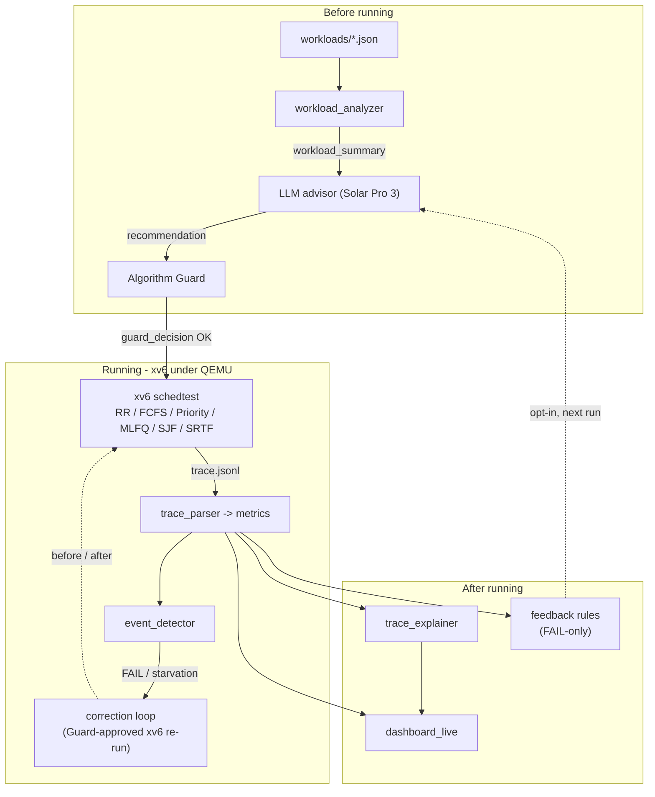

# LLM Sched Copilot

**An LLM-assisted scheduler for xv6** — course project, *Direction B (LLM for OS)*.
Upstage Solar Pro 3 **advises**, an Algorithm Guard **validates**, and **xv6 under
QEMU executes**.

## 1. Core idea
Traditional xv6 scheduling is fixed and visible only through logs. This project
turns it into a trace-verified, LLM-in-the-loop workflow: from *visible* workload
features the LLM proposes a scheduling algorithm, parameters, and burst hints; the
**Algorithm Guard** validates them; and **xv6 is the sole execution authority** —
the LLM is never on the kernel hot path and never picks the next process. We then
*measured* where an LLM actually helps. As the quantitative decision-maker
(algorithm choice, mid-run switching, numeric burst prediction) it **loses** to
cheap classical methods (shown with negative controls); at the **human interface**
(natural-language intent to config, and trace explanation) it **wins**. Conclusion:
*put the LLM at the OS's human-facing layer, not its decision hot path.*

## 2. Architecture
Three host-side phases wrap the kernel; the Orchestrator
(`scripts/orchestrator.py`) sequences them but is **not** the scheduler. All
module interfaces are JSON / JSONL.



## 3. Main features
- **Six in-kernel scheduling algorithms** — RR, FCFS, Priority+Aging, MLFQ, SJF, SRTF — plus syscalls, implemented in `xv6-riscv/`.
- **Reproducible xv6 execution** — deterministic QEMU `-icount` + fixed-iteration CPU bursts + tick-aligned start, so metrics reproduce run-to-run.
- **Algorithm Guard** — validates every LLM output (algorithm / metric / params / schema); a rejected output falls back to a safe algorithm.
- **Host-side runtime correction** — on a FAIL/starvation run, re-runs xv6 with a Guard-approved fix and records before/after (never in-kernel, never tick-level).
- **Semantic lane** (`--intent`) — natural-language workload intent to a valid scheduling config; the LLM's measured strength (8/8).
- **Observability** — natural-language trace explanation + a React dashboard.
- **Honest evaluation** — leak-free prompts, negative controls, and CIs in `outputs/*/RESULTS.md`.

## 4. Tech stack
| Layer | Technology |
|---|---|
| Kernel / OS | xv6-riscv (K&R C) on QEMU `qemu-system-riscv64`, deterministic `-icount` clock |
| Scheduling | RR / FCFS / Priority+Aging / MLFQ / SJF / SRTF in `kernel/proc.c` |
| Host control plane | Python 3 (stdlib + `python-dotenv`), `scripts/orchestrator.py` |
| LLM | Upstage **Solar Pro 3** via the OpenAI-compatible HTTP API (`tools/solar_client.py`, urllib, temperature 0) |
| Dashboard | React + Vite (`dashboard_live/`) |
| Interfaces / tests | JSON & JSONL between modules; pytest (162) + Vitest |

## 5. File structure
```
xv6-riscv/              the kernel - execution authority (schedulers, syscalls, schedtest.c)
scripts/orchestrator.py host-side control plane that drives the whole pipeline
tools/                  pipeline modules: analyzer, advisor, intent_advisor, guard,
                        trace_parser, metrics, event_detector, correction_*, trace_explainer
experiments/            evidence tools: determinism probe, burst eval, intent eval, ablations
workloads/              workload definitions (*.json)
dashboard_live/         React observability dashboard
docs/                   design notes + deliverables (technical_report, development_process, presentation/)
outputs/                generated metrics/traces + RESULTS.md evidence
```

## 6. Setup
```bash
pip install -r requirements.txt          # host deps (python-dotenv)
cp .env.example .env                      # then edit: UPSTAGE_API_KEY=<your key>
cd dashboard_live && npm install          # dashboard deps
```
- **Solar Pro 3 API key**: provided per team by the instructor (or apply at
  <https://www.upstage.ai/>). Put it in `.env` only — `.env` is git-ignored, never commit it.
- **Kernel prerequisites**: a RISC-V toolchain (`riscv64-unknown-elf-gcc`) and
  `qemu-system-riscv64`.

## 7. Pipeline and how to run
```bash
python3 scripts/orchestrator.py --workload interactive
#   [1] analyze  [2] advise  [3] guard  [4] run on xv6 (all 6 algorithms)
#   [5] export   [6] validate [7] correct [8] explain [9] feedback (FAIL-only)
python3 scripts/orchestrator.py --intent "Interactive desktop; latency matters."  # NL to config
cd dashboard_live && npm run dev          # dashboard at http://localhost:5174
cd xv6-riscv && make qemu                 # raw kernel to a shell (Ctrl-A X to quit)
```
Reproduce the evidence:
```bash
python3 experiments/xv6_determinism_probe.py             # runs reproduce run-to-run
python3 experiments/burst_random_eval.py --signal multi  # -> outputs/random_eval/RESULTS.md
python3 experiments/intent_eval.py                       # -> outputs/intent_eval/RESULTS.md
```

## 8. Demo
The React dashboard after a full run — recommendation, per-algorithm comparison,
trace (Gantt / lanes / state), metrics, runtime correction, and the
natural-language explanation:


