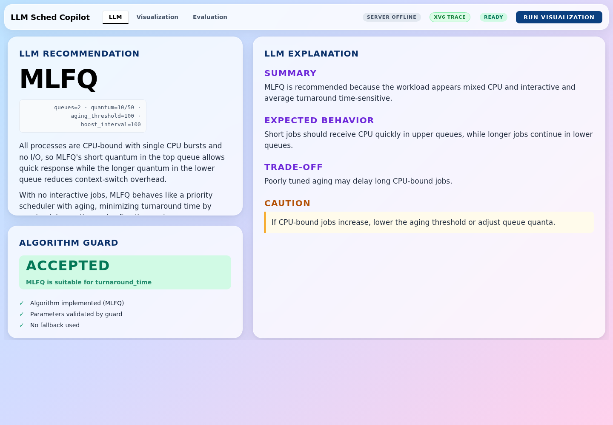
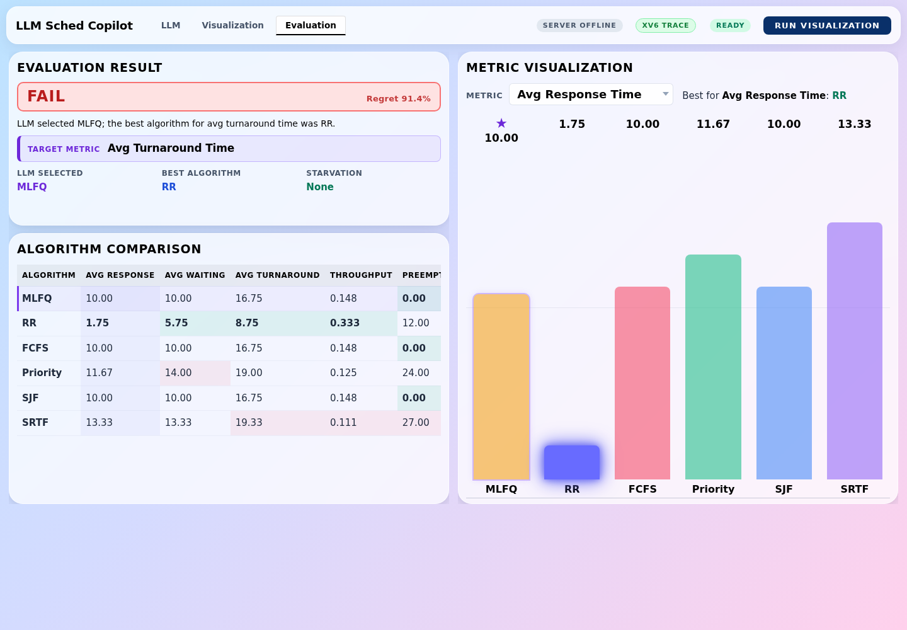

# LLM Sched Copilot

**The LLM-Assisted Scheduler for xv6** — **Direction B (LLM for OS).**

An LLM (Upstage Solar Pro 3) acts as a *hint oracle* for a classical OS mechanism —
CPU scheduling. The LLM proposes a scheduling algorithm, parameters, and per-process
burst hints from visible workload features; an **Algorithm Guard** validates whether
to follow them; and **xv6 (under QEMU) is the execution authority** — the LLM never
picks the next process and is never on the kernel hot path. The OS component (six
in-kernel scheduling algorithms, syscalls, processes, synchronization, IPC) is
implemented by the team in `xv6-riscv/`, not merely hosting an LLM.

## 1. Core Idea

Traditional xv6 scheduling behavior is usually visible only through terminal logs or source code.  
This project turns that low-level behavior into a trace-verified scheduling workflow.

A host-side **Orchestrator** (`scripts/orchestrator.py`) is the control plane. It
selects a workload, gets the LLM recommendation, validates it with the Algorithm
Guard, runs the workload on xv6 (under QEMU), parses the
trace, computes metrics, and publishes the result to the dashboard. The
Orchestrator is **not** the scheduler — it only coordinates the modules and the
run order. xv6 remains the execution authority.

```text
scripts/orchestrator.py   (host-side control plane)
        ↓
workload selection  (profile → workloads/*.json)
        ↓
tools/workload_analyzer.py        → workload_summary.json
        ↓
tools/llm_advisor.py (Solar Pro 3) → recommendation.json
        ↓
tools/algorithm_guard.py          → guard_decision.json
        ↓
xv6:  QEMU boot → schedtest run (deterministic) → xv6 scheduler logs
        ↓
tools/trace_parser.py             → normalized trace_<algo>.jsonl
        ↓
tools/metrics.py                  → metrics.json
        ↓
dashboard_live/public/live-data/  → dashboard_live
```

The **only** execution path is xv6 `schedtest` driven by the Orchestrator, and it
is **reproducible** run-to-run (deterministic QEMU clock + fixed-iteration bursts;
see [`docs/GOAL.md`](docs/GOAL.md)). There is no simulator backend.

The main question of this project is:

> Can an LLM help choose, tune, correct, and explain xv6 Scheduling Algorithms using workload summaries and Scheduling Trace Logs?

**Our measured answer (see Status box above):** for the quantitative *choices*
(algorithm, mid-run switch, burst length) — no, classical methods win; for the
*human-facing* tasks (turning English intent into a config, explaining traces) —
yes. The LLM belongs at the interface, not in the decision hot path.

### Repository layout

The repo is organised so the **core pipeline** is front-and-centre; everything
else is supporting material.

| Path | Role |
|---|---|
| `xv6-riscv/` | The kernel — **the execution authority**. xv6 runs the Scheduling Algorithm; the LLM never does. |
| `scripts/orchestrator.py` | Host-side **control plane** that drives the whole pipeline (the diagram above). |
| `tools/` | **Core pipeline modules**: workload analyzer · LLM advisor · Algorithm Guard · simulator · trace parser · metrics · event detector · correction proposer/guard · trace explainer. |
| `workloads/` | Workload definitions (`*.json`) the pipeline schedules. |
| `dashboard_live/` | GUI **observability** dashboard (React) that visualises a run. |
| `experiments/` | **Research / evidence** tools that *measure* the LLM's value (burst ablation, retrieval learning). Not part of the running pipeline — see [`experiments/README.md`](experiments/README.md). |
| `tests/` | Offline pytest + vitest suites. |
| `docs/` | Design notes, data contracts, and the [demo runbook](docs/final_demo_runbook.md). |

---

## 2. System Principle

The system separates responsibility clearly.

| Component | Responsibility |
|---|---|
| Orchestrator (`scripts/orchestrator.py`) | Host-side control plane. Sequences workload selection, LLM advice, guard, backend execution, parsing, metrics, and dashboard publish. Not the scheduler. |
| LLM | Interprets workload, recommends Scheduling Algorithm, proposes correction, explains result |
| Algorithm Guard | Checks whether the LLM output is valid and safe to apply |
| xv6 (`schedtest.c` backend) | Executes the selected Scheduling Algorithm — the **sole execution authority**; runs inside QEMU (deterministic `-icount` clock) and prints trace lines to the console. |
| Trace Monitor | Collects Scheduling Trace Logs and detects runtime events |
| Metrics Evaluator | Verifies the scheduling result with numerical metrics |
| GUI | Visualizes recommendation, execution, correction, metrics, and explanation |

The LLM is a **decision support layer**, not the kernel scheduler.

### Execution Pipeline

**xv6 + QEMU is the only execution path** (the simulator was removed). The offline
fixtures remain only so the dashboard has something to show with no API key / no
QEMU.

```
Workload (workloads/*.json or schedtest profile)
   → LLM Advisor (Upstage Solar Pro 3, tools/llm_advisor.py)
       → Algorithm Guard (tools/algorithm_guard.py)
           → xv6 + QEMU via scripts/orchestrator.py
              (kernel/proc.c · user/schedtest.c · [SCHED]/[SCHEDTEST] logs)
                  → tools/trace_parser.py → trace_<algo>.jsonl
                      → tools/metrics.py → metrics.json (judgment, regret)
                          → dashboard_live (React/Vite, port 5174)
```

| Path | Label | One-line | Audience-visible? |
|---|---|---|---|
| `xv6-riscv/` + `scripts/orchestrator.py` | **PRIMARY** | Real xv6 + QEMU execution via `schedtest`; reproducible. | yes |
| `dashboard_live/` | **PRIMARY** | Live React/Vite observability dashboard. | yes |
| `outputs/_demo_fixtures/` (`--offline-fixture`) | **FALLBACK (no API key / no QEMU)** | Committed fixture data so the dashboard still has something to show. Stamps `manifest.metadata_source = "demo_fallback"`. | yes, with badge `FALLBACK` |

> The dashboard header shows a backend badge — **`XV6 TRACE`** on the real path,
> **`FALLBACK`** when only the committed fixtures are in use. If you see anything
> other than `XV6 TRACE` during the demo, name it out loud.

---

## 3. Supported Scheduling Algorithms

The project targets the following Scheduling Algorithms.

### 3.1 Round Robin

Round Robin is the baseline Scheduling Algorithm.  
It gives runnable processes CPU time in turn and prevents a single process from monopolizing the CPU.

### 3.2 FCFS

FCFS executes processes in arrival order.  
It is simple, but it can suffer from the convoy effect when a long CPU-bound process arrives before short jobs.

### 3.3 Priority Scheduling + Aging

Priority Scheduling selects a process based on priority.  
It can improve the response of important processes, but low-priority processes may suffer from starvation.

Aging is used to reduce starvation by gradually increasing the effective priority of waiting processes.

### 3.4 MLFQ

MLFQ uses multiple queues with different time quantums.  
It can favor short or interactive jobs while demoting long CPU-bound jobs.

LLM Sched Copilot can suggest MLFQ parameters such as:

- number of queues
- time quantum for each queue
- aging threshold
- boost interval

### 3.5 SJF / SRTF + Burst Prediction

SJF and SRTF are powerful Scheduling Algorithms because they favor short CPU bursts.

However, a real OS cannot know the exact next CPU burst in advance.  
This project therefore uses a **hybrid predictor** (see §10.2 for the mechanics):

- traditional exponential averaging (EMA), always on, refined from observed CPU
- LLM-assisted **initial** burst prior, derived from visible features only
- LLM-assisted predictor parameter tuning (`alpha`, `initial`, `min`, `max`)

---

## 4. LLM Roles

The LLM works in three phases.

---

### 4.1 Before Running

#### 4.1.1 Workload Interpreter

The LLM receives a workload summary generated from observable workload information.

It may infer:

- workload type
- CPU-bound tendency
- interactive tendency
- burst variance
- priority distribution
- starvation risk
- target metric

Example output:

```json
{
  "workload_type": "interactive_heavy",
  "target_metric": "avg_response_time",
  "main_risks": ["poor_response_time", "starvation"],
  "reason": "The workload contains multiple short interactive jobs mixed with long CPU-bound jobs."
}
```

The LLM does not know exact future execution results.

#### 4.1.2 Scheduling Algorithm Advisor

The LLM recommends a Scheduling Algorithm and parameters.

Example output:

```json
{
  "recommended_scheduling_algorithm": "MLFQ",
  "params": {
    "queues": 3,
    "quantum": [2, 4, 8],
    "aging_threshold": 30,
    "boost_interval": 100
  },
  "target_metric": "avg_response_time",
  "risk": ["starvation if aging is too weak"],
  "reason": "MLFQ can favor short interactive jobs while still allowing long CPU-bound jobs to make progress."
}
```

The recommendation is sent to the Algorithm Guard before execution.

---

### 4.2 Running

#### 4.2.1 Runtime Correction Proposer & host-side apply loop *(implemented)*

During execution, the Trace Monitor watches the Scheduling Trace Log.

If a scheduling problem is detected, the system summarizes the event and asks the LLM for a correction.

Example detected events:

- starvation warning
- poor response time
- too many preemptions
- long CPU-bound domination
- high waiting time
- burst prediction failure

Example correction output:

```json
{
  "correction_type": "parameter_update",
  "current_scheduling_algorithm": "MLFQ",
  "new_params": {
    "quantum": [2, 4, 8],
    "aging_threshold": 20,
    "boost_interval": 80
  },
  "reason": "The previous aging threshold was too high, so low-priority processes waited too long."
}
```

Possible correction types:

- parameter update
- Scheduling Algorithm change
- process hint update
- aging threshold adjustment
- time quantum adjustment

The correction is re-checked by the Correction Guard before it is applied.

The correction is applied as a host-side **post-evaluation** step: after the
original run is fully evaluated, the orchestrator launches a second ordinary xv6
run with the corrected, Guard-approved algorithm/params and records the
before/after comparison in `correction_applied.json`. It is **not** applied by
interrupting every timer tick with an LLM call, and the LLM never runs inside
the kernel (see §11.1).

---

### 4.3 After Running

#### 4.3.1 Trace Explainer *(implemented, wired into the pipeline)*

After execution, the system summarizes:

- Scheduling Trace Log
- Scheduling Metrics
- detected runtime events
- comparison with other Scheduling Algorithms

Then the LLM explains the result in natural language.

Example output:

```json
{
  "summary": "FCFS performed poorly on this workload.",
  "detected_pattern": "convoy_effect",
  "main_reason": "A long CPU-bound process arrived first and delayed short interactive jobs.",
  "evidence": [
    "P1 ran from tick 0 to tick 40.",
    "P2 arrived at tick 5 but first ran at tick 41.",
    "Average response time was much higher than MLFQ."
  ],
  "suggestion": "MLFQ or Round Robin would reduce response time for short jobs."
}
```

The Trace Explainer helps users understand not only what happened, but why it happened.

#### 4.3.2 Feedback Rule Generator *(implemented, FAIL-only)*

> `tools/llm_advisor.py --mode feedback` runs as orchestrator step **[9]** and
> fires **only** when the run's judgment is FAIL (or starvation occurred);
> SUCCESS / NEAR-SUCCESS skip honestly. New non-duplicate rules are appended to
> the canonical `outputs/live/feedback_rules.md` (FIFO-capped at 20, deduped).
> Feedback is **never faked**: with no `UPSTAGE_API_KEY` the step logs an
> explicit skip rather than substituting fixture rules. Generated rules affect
> FUTURE recommendations, not the just-finished run.
>
> **Generation vs consumption (opt-in).** Generation (above) is automatic on
> FAIL. *Consumption* — injecting accumulated rules back into the advise prompt
> — is **opt-in only**, via `python3 scripts/orchestrator.py … --use-feedback`
> (or `use_feedback:true` in the run-server body). The default demo passes **no**
> `--feedback` argument, so it consumes nothing and stays deterministic; stale
> or overfit rules can never silently pollute a recommendation. When opted in,
> `manifest.feedback_consumed=true` (+ `feedback_rule_count`) records it and the
> dashboard shows a small **Feedback: ON** chip.

If the LLM recommendation was poor, the system asks the LLM to generate a feedback rule.

Example:

```json
{
  "failed_case": {
    "llm_selected": "FCFS",
    "actual_best": "MLFQ",
    "regret_score": 0.42
  },
  "feedback_rule": "If burst variance is high and many interactive jobs arrive after a long CPU-bound job, avoid FCFS and prefer MLFQ or Round Robin."
}
```

The feedback rule can be used in later LLM prompts.

---

## 5. Algorithm Guard

The Algorithm Guard prevents invalid or unsafe LLM output from being applied.

It checks:

- whether the recommended Scheduling Algorithm is implemented
- whether the parameters are in valid ranges
- whether required information exists
- whether burst prediction is available when SJF/SRTF is requested
- whether the correction type is supported
- whether the output follows the required JSON schema

Example decisions:

```json
{
  "guard_result": "accepted",
  "reason": "MLFQ is implemented and all parameters are valid."
}
```

```json
{
  "guard_result": "rejected",
  "reason": "SRTF requires burst prediction, but no predictor output was provided.",
  "fallback_scheduling_algorithm": "MLFQ"
}
```

---

## 6. Scheduling Trace Log

The Scheduling Trace Log records important scheduling events.

Example:

```text
[SCHED] tick=12 algo=RR event=DISPATCH pid=3 state=RUNNING queue=0
[SCHED] tick=16 algo=RR event=PREEMPT pid=3 state=RUNNABLE queue=0
[SCHED] tick=17 algo=RR event=DISPATCH pid=4 state=RUNNING queue=0
[SCHED] tick=45 algo=RR event=EXIT pid=4 state=ZOMBIE queue=0
```

Target events:

- ARRIVE
- DISPATCH
- PREEMPT
- SLEEP
- WAKEUP
- EXIT
- QUEUE_CHANGE
- CORRECTION_APPLIED

---

## 7. Metrics Evaluator

The Metrics Evaluator verifies whether the LLM recommendation was actually useful.

Metrics:

- average waiting time
- average response time
- average turnaround time
- throughput
- max waiting time
- starvation occurrence
- preemption count
- burst prediction error
- regret score

Definitions:

```text
response time = first_run_time - arrival_time
turnaround time = finish_time - arrival_time
waiting time = turnaround_time - total_cpu_burst_time
throughput = completed_process_count / total_execution_time
```

Recommendation judgment:

```text
SUCCESS      = LLM selected the best or near-best Scheduling Algorithm
NEAR-SUCCESS = LLM result is close to the best result
FAIL         = LLM result is clearly worse than the best result
```

---

## 8. GUI Observability Dashboard

The GUI is not the core scheduler.  
It is the observability dashboard that visualizes the whole LLM-assisted scheduling process.

### Demo



*The LLM recommends **MLFQ** with parameters and reasoning; the **Algorithm Guard** validates it (ACCEPTED); the LLM **explains** the expected behavior, trade-offs, and risks in natural language.*



*Honest evaluation: here the LLM's MLFQ pick is judged **FAIL** against the measured-best **RR** on `avg_turnaround_time` — and the safety-net **correction** re-runs RR. The dashboard surfaces the LLM being wrong rather than hiding it, which is the project's core honesty contract.*

The GUI shows (as `dashboard_live`, the primary React/Vite UI on
`http://localhost:5174`):

- **Demo flow** card (top-left): 5 numbered steps with click-to-flash
  chips to outline the matching card on screen for ~1.4 s.
- Workload Summary card.
- LLM Recommendation card + Algorithm Guard card.
- **Why this algorithm? (Recommendation Evidence)** card —
  consolidates LLM reason, workload traits, guard scores, and
  provenance.
- **Metric trade-off (Counterfactual Metric View)** card — best
  algorithm per metric; current target metric row highlighted.
- live or replayed Scheduling Trace Log (Gantt, Process Lanes,
  Trace Stack).
- Process state table.
- before/after metrics (Algorithm Comparison + Metric
  Visualization).
- Evaluation Result (judgment + regret).
- Trace Explainer result — the post-run **LLM Explanation (post-run)** card on
  the Evaluation tab renders `trace_explanation.json`, or a clear
  *NOT AVAILABLE* state when the explanation could not be generated.
- Header **data-source badge** derived from the live-data manifest
  (**`XV6 TRACE`** / `SIMULATOR` / `FALLBACK` / `SNAPSHOT` / `UNKNOWN SOURCE`)
  so simulator output is never mistaken for a real xv6 run, plus the
  phase-aware RUN button and run-state pill.

> The runtime-correction **apply loop** runs in the pipeline and writes
> `correction_applied.json`; the **feedback rules** (FAIL-only) are written to
> `outputs/live/feedback_rules.md`. Both are produced by the orchestrator today.
> Feedback *consumption* is opt-in (`--use-feedback`) and, when enabled, surfaces
> as a small **Feedback: ON** header chip; the apply loop is not yet a dedicated
> card (the explanation card is). See §11.1.

Main dashboard message:

> **LLM suggests. xv6 executes. Metrics verify. GUI explains.**

---

## 10. Data Files

Actual layout today — what the orchestrator writes and the
dashboard reads. `docs/dashboard_data_contract.md` is canonical;
`tools/validate_dashboard_contract.py --strict --snapshots …`
enforces it.

```text
workloads/*.json                       # curated workload definitions

# Orchestrator output — primary flat live-data (what dashboard_live
# reads on first paint; validated by tools/validate_dashboard_contract.py):
dashboard_live/public/live-data/manifest.json
dashboard_live/public/live-data/recommendation.json
dashboard_live/public/live-data/guard_decision.json
dashboard_live/public/live-data/workload_summary.json
dashboard_live/public/live-data/metrics.json
dashboard_live/public/live-data/trace_explanation.json
dashboard_live/public/live-data/trace_<rr|fcfs|priority|mlfq|sjf|srtf>.jsonl

# Committed per-profile xv6 snapshots (snapshots_manifest.json is the index).
# NOTE: a snapshot selector is not wired into the current live dashboard; these
# are a generated artifact set, switchable via the liveDataClient base path:
dashboard_live/public/live-data/snapshots_manifest.json
dashboard_live/public/live-data/snapshots/interactive/…
dashboard_live/public/live-data/snapshots/cpu_bound/…
dashboard_live/public/live-data/snapshots/mixed/…
dashboard_live/public/live-data/snapshots/priority_sensitive/…
```

After-running artifacts the pipeline writes today (host-side; see §11.1):

```text
outputs/live/runtime_events.json          # event_detector output (observational)
outputs/live/correction_proposal.json     # correction_proposer (preview_only)
outputs/live/correction_guard_decision.json # correction_guard re-check (preview)
outputs/live/correction_applied.json      # host-side apply loop result (applied=true/false)
outputs/live/trace_explanation.json       # trace_explainer step [8] (fresh per run, or available:false)
outputs/live/feedback_rules.md            # llm_advisor --mode feedback step [9] (FAIL-only)
```

---

## 10.1 Workload Format (v2 + hidden burst rule)

Each file in `workloads/` is a JSON object:

```jsonc
{
  "id":                      "ambiguous_mixed",       // matches the spec ID
  "description":             "...",                   // one-line for the dashboard
  "target_metric":           "avg_waiting_time",      // what we evaluate against
  "expected_best_algorithm": "SJF",                   // documented expectation
  "expected_behavior":       "On avg_waiting_time...",// teaching note
  "schema_version":          2,
  "processes": [
    {
      "pid": 1, "arrival_time": 0, "priority": 5, "label": "cpu_bound",
      "actual_bursts": [8],     // HIDDEN — execution + evaluation only
      "cpu_bursts":    [8],     // kept for backward compat (mirror of actual)
      "io_bursts":     []
    }
  ]
}
```

**Hidden actual burst rule:** the LLM advisor and the SJF/SRTF picker MUST
NOT read `actual_bursts`. The advisor reasons over the `visible_processes`
features in `workload_summary.json` (pid, arrival_time, priority, burst_count,
io_count) and — for SJF/SRTF — schedules on the EMA / LLM-predicted
`predicted_burst`. The per-process `label` is deliberately **stripped from the
prompt** (it stays on disk for the dashboard and the coarse cpu/interactive
ratios) so burst prediction is genuine multi-feature reasoning, not a one-word
tag lookup — see §10.2.

The `workloads/` directory holds the curated workloads and which
algorithm each one favours.

## 10.2 EMA and LLM Burst Prediction (SJF / SRTF)

The predictor is a **hybrid**: the LLM supplies an *initial* burst prior from
visible features, and the xv6 kernel *refines* it with EMA from observed CPU
time. The LLM never sees a true future burst; the kernel never calls the LLM.

- **EMA refinement (always on):** `tau_next = (alpha * observed + (100-alpha) * tau_prev) / 100`. Updated when a CPU burst ends, using `observed` = already-consumed CPU only. Defaults `alpha=50%, initial=10, [min=1, max=100]`. xv6 emits `[SCHED] event=PRED_UPDATE pid=… observed=… predicted_prev=… predicted_next=… alpha=…` (`kernel/proc.c update_burst_prediction()`, gated to SJF/SRTF).
- **LLM initial prior (optional):** when the advisor produces `predicted_bursts: [{pid, predicted_burst, confidence, basis}]` (from visible features ONLY), Algorithm Guard clamps each value and the orchestrator forwards them to xv6 via the `setbursthint(pid, predicted_burst)` syscall: `user/schedtest.c` applies each prior right after `fork()` (aligned to fork order through the curated `workloads/xv6_*.json` mirror), so the child's *first* SJF/SRTF decision uses the LLM prior instead of the generic `initial`.
- **Trace evidence:** an xv6 SJF/SRTF run emits `[SCHEDTEST] event=PREDICTOR_PARAMS …`, one `[SCHEDTEST] event=BURST_HINT_APPLIED pid=… index=… predicted_burst=…` per process, and `[SCHED] event=PRED_UPDATE …` as EMA refines each prior from observed CPU. The honest claim: the LLM seeds the prior from visible features; xv6 is the execution authority and corrects it from real usage. If no priors arrive, the kernel falls back to its built-in `initial` and pure EMA.
- **Why the LLM prior helps (ablation):** `experiments/burst_ablation.py` scores the LLM prior against a blind EMA cold-start and a fixed feature heuristic on held-out `actual_bursts` (read evaluator-side only, never in a prompt). Across 5 burst-relevant workloads the LLM prior nearly **doubles** blind EMA on pairwise *ordering* accuracy (≈0.90 vs 0.50) and beats the hand-coded heuristic (0.72) — and ordering is exactly what SJF/SRTF use to pick the next job. The LLM overshoots absolute *magnitude* (higher MAE), which is precisely what the EMA refinement above corrects: **the LLM ranks at cold-start, the kernel EMA calibrates magnitude.** Regenerate the report with `python3 experiments/burst_ablation.py [--advise]` → `outputs/ablation/burst_ablation.md`.

## 10.3 Running the End-to-End Demo (and without an API key)

```bash
# 1) Real LLM (Solar Pro 3) — set up once
cp .env.example .env       # then edit: UPSTAGE_API_KEY=<your key>

# 2) Full pipeline on xv6 (the only backend; runs all six algorithms)
python3 scripts/orchestrator.py --workload interactive
#     (to just build+boot the raw kernel to a shell: `cd xv6-riscv && make qemu`
#      — defaults to CPUS=1, deterministic -icount clock; Ctrl-A X to quit QEMU)

# 2b) Semantic lane — describe the workload in English; the LLM picks the config
python3 scripts/orchestrator.py --intent "Interactive desktop; latency matters most." --workload interactive

# 2c) No API key? Use the committed demo recommendation as a fixture
python3 scripts/orchestrator.py --workload interactive --offline-fixture

# 3) Start the dashboard
cd dashboard_live && npm install && npm run dev    # http://localhost:5174

# 4) Optional — RUN button server (lets the dashboard trigger a run itself)
python3 scripts/run_server.py                       # http://127.0.0.1:8765
```

### Reproduce the evaluation evidence
```bash
python3 experiments/burst_random_eval.py --signal multi   # LLM vs heuristics vs EMA on xv6 (+ negative control)
python3 experiments/intent_eval.py                        # natural-language intent → config (8/8)
python3 experiments/xv6_determinism_probe.py              # confirm xv6 runs reproduce
```

When `scripts/run_server.py` is up, the dashboard's **LLM tab** shows a RUN
control: pick backend + profile + seed, hit RUN, watch the badge flip
RUNNING → PARSING → EVALUATING → DONE, and the views auto-reload. Without
the server the RUN card hides and the dashboard is read-only over
`live-data/`.

**xv6 is deterministic-by-profile.** Its curated `schedtest.c` tables are fixed in
C with no PRNG, and the QEMU run is reproducible (deterministic `-icount` clock +
fixed-iteration bursts + tick-aligned start), so a given (profile, algorithm)
reproduces exactly run-to-run — `--seed` only labels the run. To run an *arbitrary*
workload (e.g. for the random-workload study) inject it with `schedtest --procs
"arrival:burst:prio,..."` (see `experiments/burst_random_eval.py`).

**Statistical robustness (random workloads).** A single curated run is one sample.
Because xv6 is now reproducible, statistical power comes from generating MANY
random workloads and aggregating across them. `experiments/burst_random_eval.py`
does exactly this — it runs each generated workload on xv6 under several prediction
strategies and reports **mean ± 95% CI**, separately for a signal set and a
negative-control set:

```bash
python3 experiments/burst_random_eval.py --signal multi
# → outputs/random_eval/RESULTS.md  (LLM vs heuristics vs blind EMA, with a control)
```

It reuses the orchestrator's profile-alias map (so the dashboard's profile
names work) and is simulator-only by construction — xv6 is deterministic-by-
profile, so a seed sweep there would be 20 identical runs.

## 11. Repository Structure

Actual top-level layout today (kept honest — paths that don't exist or are
misnamed should be fixed in the README, not faked):

```text
.
├── README.md
├── CLAUDE.md
├── architecture_diagram.md
├── requirements.txt
├── .env.example
├── .github/workflows/                  # lightweight CI (no QEMU)
│
├── docs/                               # PRIMARY — execution & structure reference
│   ├── architecture.md                 # three-phase architecture + module roles
│   ├── orchestrator_design.md          # control plane, backends, fairness rule
│   ├── data_format.md                  # module-to-module JSON / JSONL interfaces
│   ├── trace_format.md                 # raw [SCHED]/[SCHEDTEST] + normalized JSONL
│   ├── dashboard_data_contract.md      # canonical files the dashboard reads
│   ├── evaluation_plan.md              # metrics, thresholds, recommendation judging
│   └── xv6_profile_support.md          # xv6 workload profile coverage audit
│
├── workloads/                          # PRIMARY — curated workload JSONs
│   ├── interactive_heavy.json  · short_jobs.json  · mixed_workload.json
│   ├── long_cpu_bound_first.json  · priority_sensitive.json
│   └── starvation_risk.json
│
├── tools/                              # PRIMARY — host pipeline modules
│   ├── workload_analyzer.py
│   ├── llm_advisor.py      · solar_client.py
│   ├── algorithm_guard.py  · schema_compat.py
│   ├── intent_advisor.py               # NL intent → config (semantic lane)
│   ├── trace_parser.py     · metrics.py
│   ├── event_detector.py
│   ├── correction_proposer.py          # PREVIEW ONLY
│   ├── correction_guard.py             # PREVIEW ONLY
│   ├── trace_explainer.py
│   └── validate_dashboard_contract.py
│
├── scripts/                            # PRIMARY — host control plane
│   ├── orchestrator.py                 # main control plane
│   ├── export_profile_snapshots.py     # publish per-profile xv6 snapshots
│   └── run_server.py                   # RUN-button HTTP backend (optional)
│
├── xv6-riscv/                          # PRIMARY — final execution backend
│   ├── kernel/proc.c                   # 6 schedulers + predictor + traces
│   ├── kernel/sysproc.c · syscall.c    # setscheduler / getscheduler
│   └── user/schedtest.c                # curated profiles fork driver
│
├── dashboard_live/                     # PRIMARY — final demo UI (React/Vite)
│   ├── src/                            # 17 components + liveDataClient
│   └── public/live-data/               # generated by orchestrator + snapshots
│
└── outputs/                            # BUILD-OUTPUT (mostly gitignored)
    └── _demo_fixtures/                 # COMMITTED offline-demo fallback fixtures
```

## Dashboard roles

| Dashboard        | Role                                        | Command                              |
|------------------|---------------------------------------------|--------------------------------------|
| `dashboard_live` | **PRIMARY demo** — loads real generated JSON/JSONL from xv6 traces; shows backend badge | `cd dashboard_live && npm run dev` |

`dashboard_live` shows a backend indicator in the header: **XV6 TRACE** when the
data came from real xv6 logs, **FALLBACK** when only the committed offline
fixtures are in use.

### Run dashboard_live (primary)

```bash
# Step 1: generate live-data via the orchestrator (real xv6 + QEMU).
python3 scripts/orchestrator.py --workload interactive

# Step 2: start dashboard
cd dashboard_live
npm install
npm run dev     # http://localhost:5174
```

Step 1 alternatives, if you need finer control:

```bash
# No API key / no QEMU? Use the committed offline fixtures:
python3 scripts/orchestrator.py --workload interactive --offline-fixture

# Re-publish all four curated xv6 profile snapshots (interactive,
# cpu_bound, mixed, priority_sensitive):
python3 scripts/export_profile_snapshots.py --backend xv6
```

`dashboard_live` shows:
- **Backend badge** (`XV6 TRACE` / `FALLBACK`) in the header status bar.
- **Snapshot selector** — visible when `snapshots_manifest.json` exists. Switch between the four committed xv6 profile snapshots (`interactive`, `cpu_bound`, `mixed`, `priority_sensitive`); a purple `SNAPSHOT: <profile>` pill appears next to the dropdown when one is active. Default is the flat live-data root.
- **Manifest version** (e.g. `v16`) to confirm data freshness.
- **Last Updated** timestamp from `manifest.json`.
- **Live Polling** indicator (blinking dot = polling active; ■ = replay mode). Polling pauses while a snapshot is selected.
- **Yellow fallback warning banner** when no live data is available — run the pipeline to dismiss it.
- **Red trace error indicator** if any JSONL trace file fails to parse.
- **Demo flow** card (top-left) — 5 numbered steps with click-to-flash chips to outline the matching card on screen for ~1.4 s.

Multi-profile snapshots are published by
`python3 scripts/export_profile_snapshots.py`. The script runs the
orchestrator + strict validator per profile and writes the result
into `dashboard_live/public/live-data/snapshots/<profile>/`.

### Build

```bash
cd dashboard_live && npm run build
```

---

## 11.1 Implementation Status

Concise current status:

| Component | Status | Role |
|-----------|--------|------|
| xv6 scheduler — RR / FCFS / Priority+Aging / MLFQ / SJF / SRTF | **Implemented** | execution authority |
| Orchestrator — xv6 backend (`scripts/orchestrator.py`) | **Implemented** | **the sole execution path** (deterministic) |
| xv6 workload profiles — `interactive`, `cpu_bound`, `mixed`, `priority_sensitive` | **Implemented** | all 4 run on xv6 end-to-end ([audit](docs/xv6_profile_support.md)) |
| Orchestrator — simulator backend | **Removed** | xv6 is now the sole backend (deterministic); the Python simulator + its tests were deleted |
| Determinism — `-icount` + fixed-iteration bursts + tick-aligned start | **Implemented** | xv6 runs reproduce run-to-run (`experiments/xv6_determinism_probe.py`, `docs/GOAL.md`) |
| Intent advisor + `--intent` (NL → config) | **Implemented** | 8/8 rubric ([`outputs/intent_eval/RESULTS.md`](outputs/intent_eval/RESULTS.md)) |
| Random-workload burst study (`--procs`, signal/control, CIs) | **Implemented** | [`outputs/random_eval/RESULTS.md`](outputs/random_eval/RESULTS.md) |
| `scripts/export_profile_snapshots.py` + committed per-profile xv6 snapshots | **Implemented** | dashboard switches across `interactive` / `cpu_bound` / `mixed` / `priority_sensitive` without re-running QEMU |
| `tools/validate_dashboard_contract.py` (`--strict --snapshots --preview …`) | **Implemented** | catches empty traces, missing manifest fields, cross-file algo disagreement; `--snapshots` extends per profile snapshot; `--preview` is opt-in and validates the runtime-correction preview artifacts (`preview_only=true`, `applied=false`, no `CORRECTION_APPLIED`). Default mode is unchanged — preview files remain optional and off the strict contract. |
| `dashboard_live` (React + `public/live-data/`) | **Implemented** | **final demo UI** — backend badge + snapshot selector + manifest meta + per-row Judge |
| `dashboard_live` Demo flow + Why this algorithm + Metric trade-off cards | **Implemented** | DemoGuide (click-to-flash), RecommendationEvidence ("Why this algorithm?"), CounterfactualMetricView ("Metric trade-off") — see PRs #32 #43 #46 #47 |
| `.github/workflows/ci.yml` (lightweight CI) | **Implemented** | py_compile + strict validator on committed live-data + dashboard_live build. **No QEMU/xv6 in CI** — local orchestrator run remains authoritative |
| `trace_parser.py` real-log support + lenient `RUN_BEGIN` recovery | **Implemented** | survives kernel/user printf interleave |
| LLM Advisor (Solar Pro 3) + Algorithm Guard | **Implemented** | Runtime backend is Upstage Solar Pro 3. The orchestrator is **strict by default**: missing/invalid `UPSTAGE_API_KEY` or any advisor failure exits with a clear error. Pass `--offline-fixture` (or `--allow-fallback`) to opt in to the committed `outputs/_demo_fixtures/` fixtures; that path stamps `manifest.metadata_source = "demo_fallback"`. |
| Runtime correction — host-side post-evaluation apply loop (detect → propose → correction-guard → re-run xv6 → before/after → `correction_applied.json`) | **Implemented** | `scripts/orchestrator.py` step [7]. NOT kernel hot-path / not tick-level / no in-kernel LLM. Simulator backend = intentional no-op. |
| Trace Explainer (`tools/trace_explainer.py`, orchestrator step [8]) | **Implemented** | fresh `trace_explanation.json` per run or explicit `available:false`; rendered on the Evaluation tab |
| Feedback Rule Generator (`llm_advisor --mode feedback`, orchestrator step [9]) | **Implemented (FAIL-only)** | fires only on FAIL/starvation; never faked when no API key; FIFO-capped + deduped in `outputs/live/feedback_rules.md`. **Generation is automatic; consumption is opt-in** — only `--use-feedback` injects rules back into the advise prompt (default demo consumes nothing → deterministic). |
| Core unit tests (`tests/`, pytest) + CI step | **Implemented** | guard / metrics / trace_parser / workloads; offline, no API key |
| Live streaming | **Polling only** | no websocket; `manifest.json` poll |

> **LLM suggests. Algorithm Guard checks. xv6 executes. Metrics verify. GUI explains.**

See `docs/orchestrator_design.md` for the control plane and fairness design.

---

## 12. OS Concepts Used

This project directly uses the following OS concepts:

- process
- process state
- CPU scheduling
- ready queue
- preemption
- context switch
- system calls
- priority
- starvation
- aging
- Scheduling Metrics
- trace-based observability

---

## 13. Tech Stack

### OS Environment

- xv6-riscv
- QEMU
- RISC-V toolchain
- WSL or Linux

### xv6 Implementation

- C
- xv6 scheduler
- xv6 system calls
- xv6 user programs

### Host-side Tools

- Python
- JSON / JSONL
- trace parser
- Metrics Evaluator
- LLM API client

### GUI

- **Primary:** React + Vite (`dashboard_live`) — loads generated JSON/JSONL
  from `public/live-data/`. Polls `manifest.json` every 1 s in live mode.

### LLM Backend

- **Runtime LLM backend** — Upstage Solar Pro 3 API, accessed via
  `tools/solar_client.py` (stdlib `urllib` only, no vendor SDK at
  runtime).
- **Development tool** — Claude Code is used only as the coding agent
  in the editor. It is *not* a runtime project dependency.

API keys must not be committed to GitHub. The repo only ships
`.env.example` with placeholders; the real key lives in a local `.env`
that is git-ignored.

```bash
cp .env.example .env          # then edit .env to add UPSTAGE_API_KEY
```

If `UPSTAGE_API_KEY` is missing at call time, `tools/solar_client.py`
fails fast with a clear error rather than silently faking a response.

---

## 14. Development Roadmap

### Phase 1 — Basic Trace and Metrics

- implement Scheduling Trace Log
- parse trace into structured data
- calculate basic Scheduling Metrics
- visualize Gantt chart

### Phase 2 — Multiple Scheduling Algorithms

- preserve Round Robin baseline
- implement FCFS
- implement Priority Scheduling + Aging
- implement MLFQ
- add Scheduling Algorithm control interface

### Phase 3 — LLM Scheduling Algorithm Advisor

- generate workload summary
- call Solar Pro 3 API
- receive Scheduling Algorithm recommendation JSON
- validate recommendation with Algorithm Guard

### Phase 4 — Runtime Correction

- detect starvation and poor response time
- request LLM correction
- validate correction
- apply correction as a host-side post-evaluation re-run (a second xv6 run with the corrected algorithm), not from inside the kernel
- compare before/after metrics

### Phase 5 — Trace Explainer and Feedback Rule Generator

- summarize trace and metrics
- generate natural-language explanation
- generate feedback rules from failed recommendations
- display explanation in GUI

### Phase 6 — Optional Burst Prediction Experiment

- implement traditional exponential averaging
- test LLM-assisted burst prediction
- compare predicted burst and actual burst
- compare SJF/SRTF performance with different predictors

---

## 15. Limitations

- The LLM is not called at every timer tick.
- The LLM does not directly choose the next process.
- The LLM does not directly modify xv6 kernel state.
- Runtime correction is applied only after validation.
- Runtime correction takes effect as a host-side post-evaluation re-run, not mid-run inside the kernel.
- Future CPU bursts are not given to the LLM as answers.
- Controlled workloads may be used for reproducible experiments.
- **xv6 runs single-CPU (`CPUS=1`).** The kernel reads scheduler globals
  without locking, which is only safe on one hart; the orchestrator pins
  `-smp 1` and a bare `make qemu` now defaults to `CPUS=1`. See
  [`docs/system_limitations.md`](docs/system_limitations.md).
- **Two PID namespaces on xv6.** Workload-definition PIDs (recommendation) and
  kernel runtime PIDs (traces/metrics) differ; `metrics.process_count` is `N+1`
  (it counts the `schedtest` harness). See
  [`docs/data_format.md`](docs/data_format.md#pid-namespaces-workload-index-vs-kernel-runtime-pid).

---

## 16. One-sentence Summary

**LLM Sched Copilot is an LLM-for-OS system where an LLM recommends and explains xv6 Scheduling Algorithms (and proposes runtime corrections as preview-only work), while the Algorithm Guard checks the recommendation, xv6 executes it as the authority, and metrics verify whether it was useful.**

> The LLM recommendation is a *hypothesis*: the Algorithm Guard validates it, xv6 (not the LLM) executes the chosen algorithm and remains the execution authority, and the Metrics Evaluator decides whether the hypothesis actually helped. The LLM never picks the next process at a timer tick and never modifies xv6 kernel state.
