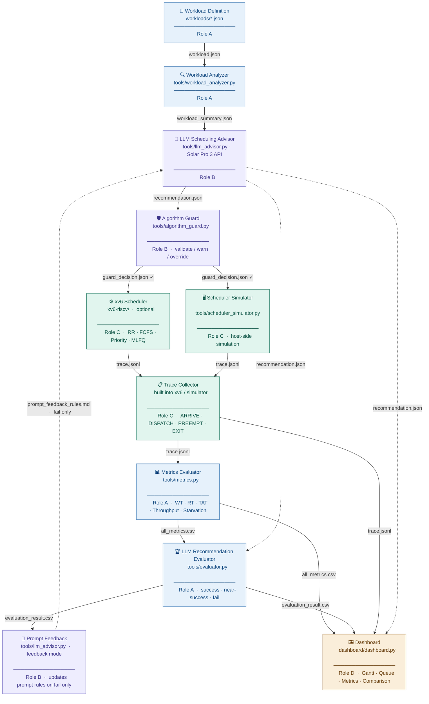
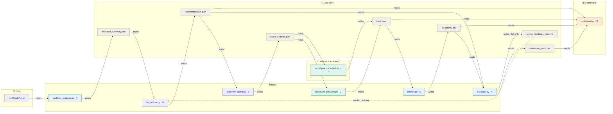
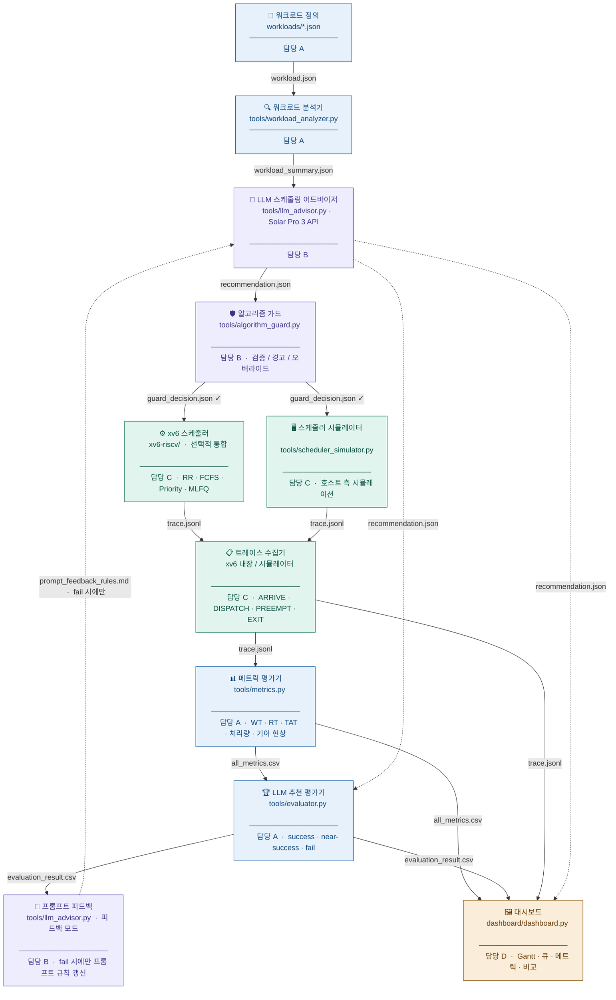
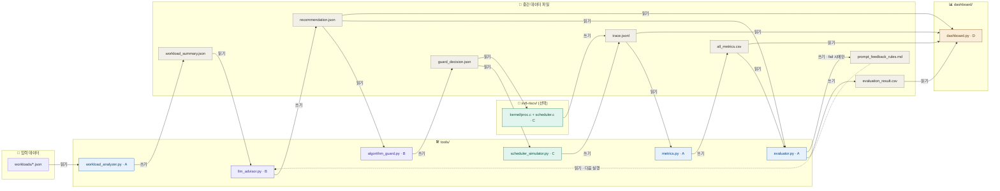

# Visual Scheduler — Architecture Diagram

---

## ─── ENGLISH VERSION ───────────────────────────────────────────────────────

### 1. Execution Flow



---

### 2. Module Interaction — File I/O



---

### 3. Data Format Reference

| File | Format | Producer | Consumer | Role |
|------|--------|----------|----------|------|
| `workloads/*.json` | JSON array | Manual / Role A | `workload_analyzer.py` | A |
| `workload_summary.json` | JSON object | `workload_analyzer.py` | `llm_advisor.py` | A |
| `recommendation.json` | JSON object | `llm_advisor.py` | `algorithm_guard.py`, `evaluator.py`, dashboard | B |
| `guard_decision.json` | JSON object | `algorithm_guard.py` | `scheduler_simulator.py`, xv6 | B |
| `trace.jsonl` | JSON Lines | xv6 / `scheduler_simulator.py` | `metrics.py`, dashboard | C |
| `all_metrics.csv` | CSV | `metrics.py` | `evaluator.py`, dashboard | A |
| `evaluation_result.csv` | CSV | `evaluator.py` | dashboard | A |
| `prompt_feedback_rules.md` | Markdown | `evaluator.py` | `llm_advisor.py` (next run, fail only) | B |

---

### 4. Role Legend

| Role | Color | Responsibility |
|------|-------|----------------|
| **A** | Blue | Workload definition · Metrics calculation · LLM recommendation evaluation |
| **B** | Purple | LLM advisor · Algorithm guard (validate/warn/override) · Prompt feedback |
| **C** | Teal | Scheduler engine · xv6 integration · Trace generation |
| **D** | Amber | Dashboard · Visualization · Integration · Documentation |

---

### 5. Metric Definitions

```
response_time   = first_run_time − arrival_time
turnaround_time = finish_time − arrival_time
waiting_time    = turnaround_time − total_cpu_burst_time
throughput      = completed_process_count / total_execution_time
```

---

### 6. Key Design Rules

- **LLM does NOT control the scheduler directly.** It outputs `recommendation.json` only.
- **Algorithm Guard** validates that the recommended algorithm exists in xv6 and is logically consistent with the target metric. It may warn or override.
- **Feedback loop** fires only on `fail` evaluation — `near-success` is accepted without prompt update.
- **RR baseline** must always be preserved as a comparison reference.
- **API key** lives in `.env` only — never committed to Git. Add `.env` to `.gitignore`.
- **xv6 kernel C** follows K&R style with tabs for indentation.

---

### 7. How Each Teammate Should Use This Diagram

**Role A — Workload / Metrics / Evaluation**
Use the execution flow to locate your three modules: workload definition (step 1), metrics calculation (after trace arrives), and LLM recommendation evaluation (final verdict). Every file you write must match the Data Format Reference table exactly so that downstream modules B, C, and D can consume it without any conversion.

**Role B — LLM Advisor / Algorithm Guard / Prompt Feedback**
Your modules form the decision layer. `llm_advisor.py` reads `workload_summary.json` and must output `recommendation.json` in the agreed schema — a scheduling algorithm recommendation, not a direct scheduler command. `algorithm_guard.py` then validates that output: it checks whether the recommended algorithm is implemented in xv6 and whether it is logically consistent with the target metric, and may warn or override if not. When `evaluator.py` returns `fail`, your feedback module rewrites `prompt_feedback_rules.md`, which is re-injected into the next LLM prompt. The LLM must never touch xv6 state directly.

**Role C — Scheduler Engine / Trace Generation**
You own the xv6 kernel modifications and the host-side simulator. Both paths must emit `trace.jsonl` in the exact event format agreed in Phase 0 (`ARRIVE`, `DISPATCH`, `PREEMPT`, `EXIT`). The simulator is the default development path; xv6 integration is optional but uses the same output format. Never change the trace schema without first coordinating with Role A (metrics parser) and Role D (dashboard reader).

**Role D — Dashboard / Integration / Documentation**
`dashboard.py` is the only module that consumes all four data files simultaneously (`trace.jsonl`, `all_metrics.csv`, `recommendation.json`, `evaluation_result.csv`). Use the module interaction diagram to verify file paths and reading order before coding. Keep this architecture diagram current as the system evolves — it is the team's single source of truth for interfaces between modules.

---
---

## ─── 한글 버전 ──────────────────────────────────────────────────────────────

### 1. 실행 흐름



---

### 2. 모듈 상호작용 — 파일 입출력



---

### 3. 데이터 형식 레퍼런스

| 파일 | 형식 | 생성 모듈 | 소비 모듈 | 담당 |
|------|------|-----------|-----------|------|
| `workloads/*.json` | JSON 배열 | 수동 / 담당 A | `workload_analyzer.py` | A |
| `workload_summary.json` | JSON 객체 | `workload_analyzer.py` | `llm_advisor.py` | A |
| `recommendation.json` | JSON 객체 | `llm_advisor.py` | `algorithm_guard.py`, `evaluator.py`, 대시보드 | B |
| `guard_decision.json` | JSON 객체 | `algorithm_guard.py` | `scheduler_simulator.py`, xv6 | B |
| `trace.jsonl` | JSON Lines | xv6 / `scheduler_simulator.py` | `metrics.py`, 대시보드 | C |
| `all_metrics.csv` | CSV | `metrics.py` | `evaluator.py`, 대시보드 | A |
| `evaluation_result.csv` | CSV | `evaluator.py` | 대시보드 | A |
| `prompt_feedback_rules.md` | 마크다운 | `evaluator.py` | `llm_advisor.py` (다음 실행, fail 시에만) | B |

---

### 4. 역할 범례

| 역할 | 색상 | 담당 업무 |
|------|------|-----------|
| **A** | 파란색 | 워크로드 정의 · 메트릭 계산 · LLM 추천 평가 |
| **B** | 보라색 | LLM 어드바이저 · 알고리즘 가드(검증/경고/오버라이드) · 프롬프트 피드백 |
| **C** | 청록색 | 스케줄러 엔진 · xv6 연동 · 트레이스 생성 |
| **D** | 황색 | 대시보드 · 시각화 · 통합 · 문서화 |

---

### 5. 메트릭 정의

```
응답 시간 (response_time)   = first_run_time − arrival_time
반환 시간 (turnaround_time) = finish_time − arrival_time
대기 시간 (waiting_time)    = turnaround_time − total_cpu_burst_time
처리량   (throughput)       = 완료된 프로세스 수 / 전체 실행 시간
```

---

### 6. 핵심 개발 규칙

- **LLM은 스케줄러를 직접 제어하지 않는다.** `recommendation.json`만 출력하며, 실제 실행은 xv6 또는 시뮬레이터가 담당한다.
- **알고리즘 가드**는 추천 알고리즘이 xv6에 실제로 구현되어 있는지, 목표 메트릭과 논리적으로 일치하는지 검증한다. 문제가 있으면 경고하거나 오버라이드한다.
- **피드백 루프**는 `fail` 평가 시에만 동작한다. `near-success`는 피드백 없이 수용한다.
- **RR 베이스라인**은 항상 비교 기준으로 보존되어야 한다.
- **API 키**는 `.env`에만 저장하고 절대 Git에 커밋하지 않는다. `.env`를 `.gitignore`에 추가할 것.
- **xv6 커널 C 코드**는 K&R 스타일을 따르며, 들여쓰기는 탭을 사용한다.

---

### 7. 각 팀원이 개발할 때 이 다이어그램을 어떻게 사용해야 하는가

**담당 A — 워크로드 / 메트릭 / 평가**
실행 흐름 다이어그램에서 자신이 맡은 세 단계를 확인한다. 워크로드 정의(첫 단계), 트레이스 도착 후 메트릭 계산, LLM 추천 성공 여부를 판정하는 최종 평가 단계가 그것이다. 자신이 출력하는 파일 형식이 데이터 형식 레퍼런스 테이블과 반드시 일치해야 한다. 다운스트림 모듈(B, C, D)이 변환 없이 바로 소비할 수 있어야 한다.

**담당 B — LLM 어드바이저 / 알고리즘 가드 / 프롬프트 피드백**
시스템의 판단 계층을 담당한다. `llm_advisor.py`는 `workload_summary.json`을 읽고 합의된 스키마의 `recommendation.json`을 출력해야 한다. 이 출력은 스케줄러에 대한 직접 명령이 아닌 알고리즘 추천이다. `algorithm_guard.py`는 그 출력을 검증하여, 추천 알고리즘이 xv6에 구현되어 있지 않거나 목표 메트릭과 맞지 않으면 경고 또는 오버라이드한다. `evaluator.py`가 `fail`을 반환하면 피드백 모듈이 `prompt_feedback_rules.md`를 재작성하고, 다음 LLM 호출 시 이를 다시 읽는다. LLM이 xv6 상태를 직접 건드리는 일은 절대 없어야 한다.

**담당 C — 스케줄러 엔진 / 트레이스 생성**
xv6 커널 수정과 호스트 측 시뮬레이터 전체를 담당한다. 두 경로 모두 Phase 0에서 합의한 이벤트 형식(`ARRIVE`, `DISPATCH`, `PREEMPT`, `EXIT`)으로 `trace.jsonl`을 출력해야 한다. 시뮬레이터가 기본 개발 경로이며, xv6 통합은 선택이지만 동일한 출력 형식을 사용한다. 트레이스 스키마를 변경할 때는 반드시 먼저 담당 A(메트릭 파서)와 담당 D(대시보드)에 공유할 것.

**담당 D — 대시보드 / 통합 / 문서화**
`dashboard.py`는 네 가지 데이터 파일(`trace.jsonl`, `all_metrics.csv`, `recommendation.json`, `evaluation_result.csv`)을 동시에 읽는 유일한 소비자다. 모듈 상호작용 다이어그램으로 파일 경로와 읽기 순서를 코딩 전에 반드시 확인할 것. 시스템이 발전하면서 이 아키텍처 다이어그램을 최신 상태로 유지하는 것도 담당 D의 역할이다. 이 다이어그램은 모듈 간 인터페이스에 대한 팀의 단일 진실 공급원(Single Source of Truth)이다.
