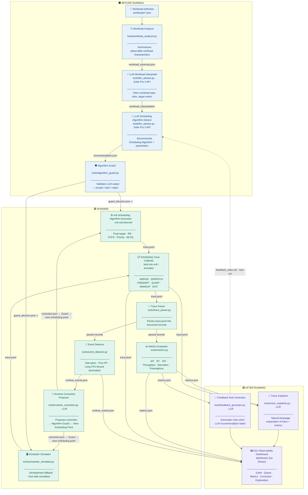
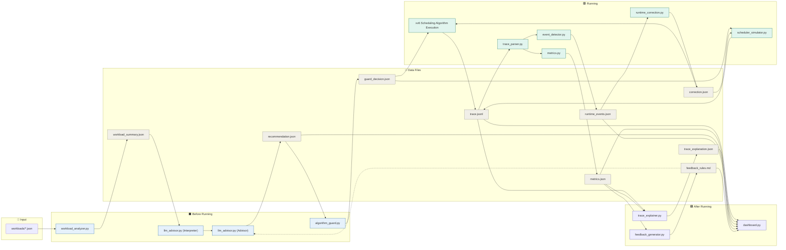

# LLM Sched Copilot — Architecture Diagram

---

## ─── ENGLISH VERSION ───────────────────────────────────────────────────────

### 1. Three-Phase Execution Flow



---

### 2. Module Interaction — File I/O



---

### 3. Data Format Reference

| File | Format | Producer | Consumer |
|------|--------|----------|----------|
| `workloads/*.json` | JSON array | Manual | `workload_analyzer.py` |
| `workload_summary.json` | JSON object | `workload_analyzer.py` | `llm_advisor.py` |
| `recommendation.json` | JSON object | `llm_advisor.py` | `algorithm_guard.py`, dashboard |
| `guard_decision.json` | JSON object | `algorithm_guard.py` | xv6 / `scheduler_simulator.py` |
| `trace.jsonl` | JSON Lines | xv6 / `scheduler_simulator.py` | `trace_parser.py`, `trace_explainer.py`, dashboard |
| `metrics.json` | JSON object | `metrics.py` | `trace_explainer.py`, `feedback_generator.py`, dashboard |
| `runtime_events.json` | JSON object | `event_detector.py` | `runtime_correction.py`, dashboard |
| `correction.json` | JSON object | `runtime_correction.py` | `algorithm_guard.py` → xv6 / simulator |
| `trace_explanation.json` | JSON object | `trace_explainer.py` | dashboard |
| `feedback_rules.md` | Markdown | `feedback_generator.py` | `llm_advisor.py` (next run, fail only) |

---

### 4. Phase Legend

| Phase | Color | Modules |
|-------|-------|---------|
| **Before Running** | Blue | Workload Analyzer · LLM Workload Interpreter · LLM Scheduling Algorithm Advisor · Algorithm Guard |
| **Running** | Teal | xv6 Scheduling Algorithm Execution · Scheduler Simulator · Trace Collector · Trace Parser · Metrics Evaluator · Event Detector · Runtime Correction Proposer |
| **After Running** | Purple | Trace Explainer · Feedback Rule Generator · GUI Observability Dashboard |

---

### 5. Metric Definitions

```
response_time   = first_run_time − arrival_time
turnaround_time = finish_time − arrival_time
waiting_time    = turnaround_time − total_cpu_burst_time
throughput      = completed_process_count / total_execution_time
```

---

### 6. Key Design Rules

- **LLM is not the scheduler.** It outputs `recommendation.json` and `correction.json` only.
- **xv6 is the execution authority.** All Scheduling Algorithm execution happens inside xv6 (or the simulator as a fallback).
- **Algorithm Guard** validates every LLM output — recommendation and runtime correction — before it is applied.
- **Runtime correction** is applied from the next scheduling point, not mid-tick.
- **Future CPU bursts** must not be given to the LLM as input.
- **Feedback loop** fires only on `FAIL` evaluation.
- **RR baseline** must always be preserved as a comparison reference.
- **API key** lives in `.env` only — never committed to Git.
- **All module interfaces** use JSON or JSON Lines (JSONL). Do not use CSV for new interfaces.

---

### 7. One-Line Summary

> **LLM suggests. Algorithm Guard checks. xv6 executes. Metrics verify. GUI explains.**

---
---

## ─── 한글 버전 ──────────────────────────────────────────────────────────────

### 1. 3단계 실행 흐름


---

### 2. 데이터 형식 레퍼런스

| 파일 | 형식 | 생성 모듈 | 소비 모듈 |
|------|------|-----------|-----------|
| `workloads/*.json` | JSON 배열 | 수동 | `workload_analyzer.py` |
| `workload_summary.json` | JSON 객체 | `workload_analyzer.py` | `llm_advisor.py` |
| `recommendation.json` | JSON 객체 | `llm_advisor.py` | `algorithm_guard.py`, 대시보드 |
| `guard_decision.json` | JSON 객체 | `algorithm_guard.py` | xv6 / `scheduler_simulator.py` |
| `trace.jsonl` | JSON Lines | xv6 / `scheduler_simulator.py` | `trace_parser.py`, `trace_explainer.py`, 대시보드 |
| `metrics.json` | JSON 객체 | `metrics.py` | `trace_explainer.py`, `feedback_generator.py`, 대시보드 |
| `runtime_events.json` | JSON 객체 | `event_detector.py` | `runtime_correction.py`, 대시보드 |
| `correction.json` | JSON 객체 | `runtime_correction.py` | `algorithm_guard.py` → xv6 / 시뮬레이터 |
| `trace_explanation.json` | JSON 객체 | `trace_explainer.py` | 대시보드 |
| `feedback_rules.md` | 마크다운 | `feedback_generator.py` | `llm_advisor.py` (다음 실행, fail 시에만) |

---

### 3. 단계별 범례

| 단계 | 색상 | 모듈 |
|------|------|------|
| **실행 전** | 파란색 | 워크로드 분석기 · LLM 워크로드 인터프리터 · LLM 스케줄링 알고리즘 어드바이저 · 알고리즘 가드 |
| **실행 중** | 청록색 | xv6 스케줄링 알고리즘 실행 · 스케줄러 시뮬레이터 · 트레이스 수집기 · 트레이스 파서 · 메트릭 평가기 · 이벤트 감지기 · 런타임 보정 제안기 |
| **실행 후** | 보라색 | 트레이스 설명기 · 피드백 규칙 생성기 · GUI 관측 대시보드 |

---

### 4. 메트릭 정의

```
응답 시간 (response_time)   = first_run_time − arrival_time
반환 시간 (turnaround_time) = finish_time − arrival_time
대기 시간 (waiting_time)    = turnaround_time − total_cpu_burst_time
처리량   (throughput)       = 완료된 프로세스 수 / 전체 실행 시간
```

---

### 5. 핵심 설계 규칙

- **LLM은 스케줄러가 아니다.** `recommendation.json`과 `correction.json`만 출력한다.
- **xv6가 실행 권한을 갖는다.** 모든 스케줄링 알고리즘 실행은 xv6(또는 시뮬레이터)에서 이루어진다.
- **알고리즘 가드**는 LLM의 모든 출력(추천 및 런타임 보정)을 적용 전 검증한다.
- **런타임 보정**은 다음 스케줄링 시점에 적용된다. 매 타이머 틱마다 LLM을 호출하지 않는다.
- **미래 CPU 버스트**는 LLM에게 입력으로 제공하지 않는다.
- **피드백 루프**는 `FAIL` 평가 시에만 동작한다.
- **RR 베이스라인**은 항상 비교 기준으로 보존되어야 한다.
- **API 키**는 `.env`에만 저장하고 절대 Git에 커밋하지 않는다.
- **모든 모듈 인터페이스**는 JSON 또는 JSON Lines(JSONL)를 사용한다.

---

### 6. 한 줄 요약

> **LLM이 제안한다. 알고리즘 가드가 검증한다. xv6가 실행한다. 메트릭이 검증한다. GUI가 설명한다.**
