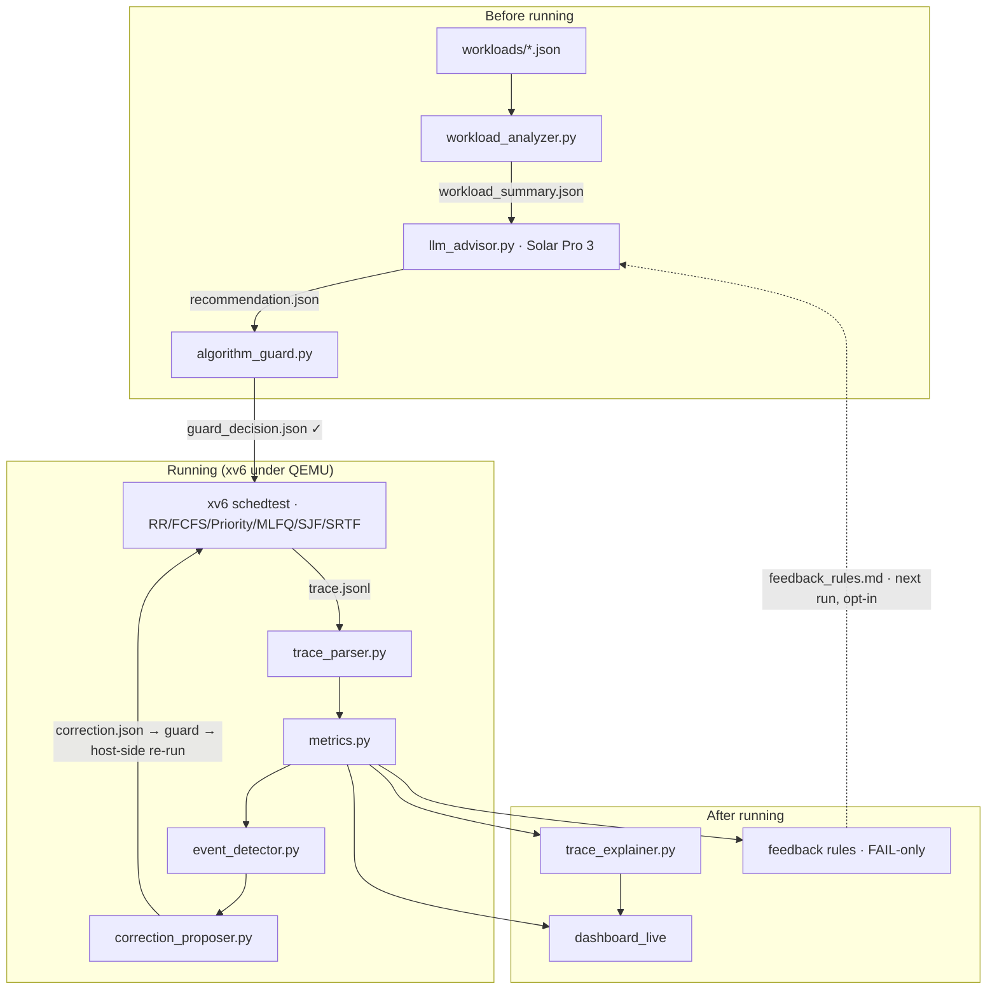

# LLM Sched Copilot — Architecture

Three host-side phases wrap **xv6 (the sole execution authority)**. The LLM only
emits `recommendation.json` / `correction.json`; the Algorithm Guard validates
every LLM output before it is applied; xv6 runs the algorithm and the metrics
verify it.



## Data interfaces (all JSON / JSONL — no CSV)
| file | producer → consumer |
|---|---|
| `workload_summary.json` | analyzer → advisor |
| `recommendation.json` | advisor → guard, dashboard |
| `guard_decision.json` | guard → xv6 |
| `trace_<algo>.jsonl` | xv6 → parser, explainer, dashboard |
| `metrics.json` | metrics → explainer, advisor(feedback), dashboard |
| `runtime_events.json` → `correction_applied.json` | event_detector → correction loop → dashboard |
| `trace_explanation.json` | explainer → dashboard |
| `feedback_rules.md` | advisor(FAIL) → advisor(next run, opt-in) |

## Metrics
```
response_time   = first_run_time − arrival_time
turnaround_time = finish_time − arrival_time
waiting_time    = turnaround_time − total_cpu_burst_time
throughput      = completed_process_count / total_execution_time
```

## Design rules
- LLM is **not** the scheduler; xv6 is the execution authority.
- The Algorithm Guard validates every LLM output before it is applied.
- Runtime correction is a **host-side post-evaluation re-run** (a second xv6 run),
  not mid-run kernel injection; the LLM is never on the kernel hot path.
- Future CPU bursts are never given to the LLM. RR baseline is always kept.
- API key lives in `.env` only (git-ignored).

> **LLM suggests · Algorithm Guard checks · xv6 executes · metrics verify · GUI explains.**

See `docs/orchestrator_design.md` (control plane), `docs/trace_format.md` and
`docs/dashboard_data_contract.md` (formats), `docs/system_limitations.md` (limits).
